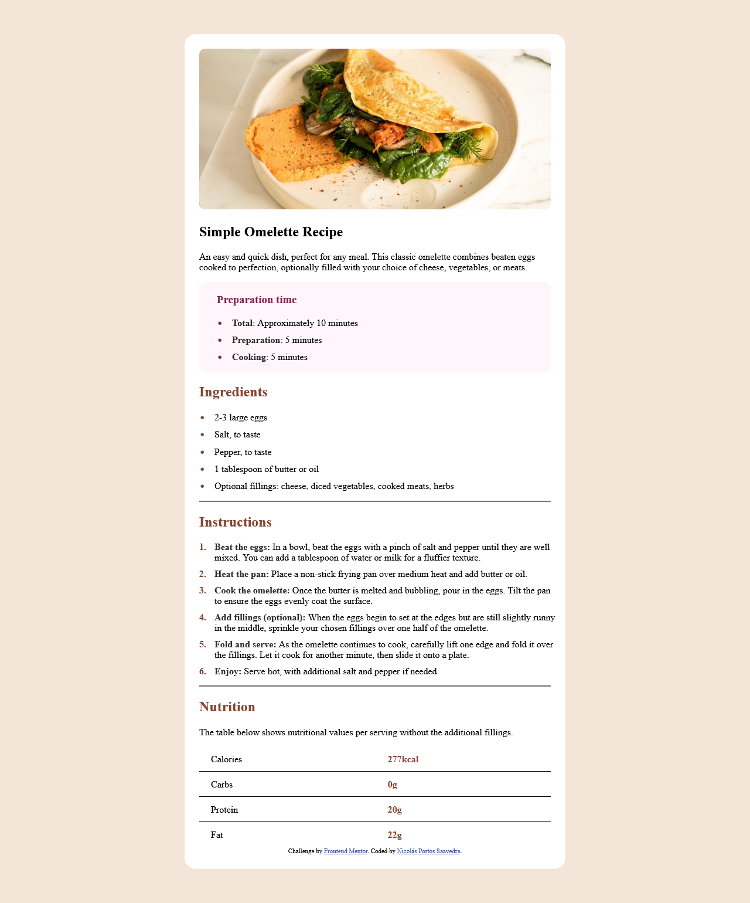

# Frontend Mentor - Recipe page solution

This is a solution to the [Recipe page challenge on Frontend Mentor](https://www.frontendmentor.io/challenges/recipe-page-KiTsR8QQKm). Frontend Mentor challenges help you improve your coding skills by building realistic projects. 

## Table of contents

- [Overview](#overview)
  - [Screenshot](#screenshot)
  - [Links](#links)
- [My process](#my-process)
  - [Built with](#built-with)
  - [What I learned](#what-i-learned)
- [Author](#author)

## Overview

### Screenshot

**Note: Delete this note and the paragraphs above when you add your screenshot. If you prefer not to add a screenshot, feel free to remove this entire section.**

### Links

- Live Site URL: [Add live site URL here](https://nicolas-portos.github.io/recipe-page-main/index.html)

## My process

### Built with

- Semantic HTML5 markup
- CSS 

### What I learned

This project made me realize how much time has passed since I studied HTML, it was a good way to practice a little bit and remember some things.

## Author

- Frontend Mentor - [@nicolas-portos](https://www.frontendmentor.io/profile/nicolas-portos)